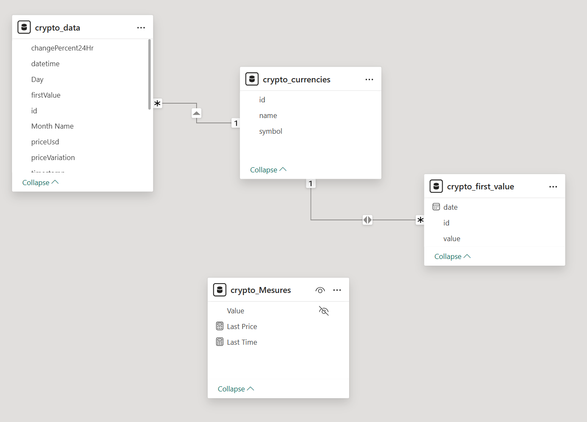
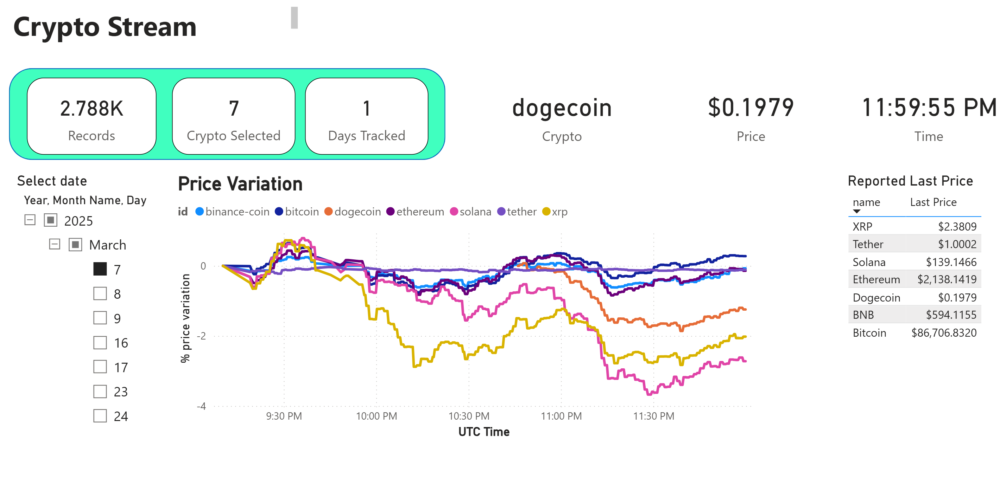

| APIs | KAFKA | PYTHON | DIRECTORY FILES | DOCKER | POWERBI |
|---|---|---|---|---|---| 
| Data Source | ETL Pipeline | Scripting | Data Storage | Containerization | Data Visualization |

## Introduction

**CryptoStreamTracker** is a cutting-edge project designed to track and analyze cryptocurrency changes in real-time. By leveraging the power of Apache Kafka, Python, and Power BI, this project offers a robust and scalable solution for real-time data processing and visualization.

## Key Components & Tools

1. **Source Data:**
   - **API Request:** Utilize the **COPINCAP API** to fetch real-time data.
   - **Selection:** Focus on 5 key cryptocurrencies for tracking and analysis.

2. **Data Streaming:**
   - **Kafka:** Employ Apache Kafka to stream the selected cryptocurrency data in real-time.
   - **Python Kafka Client:** Use the Python Kafka Client to implement and manage data streams.

3. **Data Storage:**
   - **CSV Storage:** Save real-time data streams into CSV files for seamless reading and visualization in Power BI.
   - **Historical Data Storage:** Store processed historical data in CSV files for comprehensive analysis.
   
4. **Docker Containers:**
   - **Kafka:** Containerize these components using Docker and Docker Compose to ensure efficient deployment and management.


## Arquitecture


## Data Model
This model is based in a CSV file that is updated by the Kafka Consumer with the last variations of cripto prices.  

The differents tables commes mainly from a single CSV **file crypto_data.csv**



## Environments
The environment is launch in dockers containers.   Docker compose is launch to create differents brockers. 

-  [docker_compose.yml](docker-compose.yml)

* Starts and runs your entire application (go to directory project to execute this command)
```bash
docker compose up
```
* To stop a Docker Compose application, you use the following command in the same directory:
```bash
docker compose down
```

## Scripts
For this project, we utilize Python along with libraries such as Confluent Kafka.

There are two script files:

- [producer.py](script/producer.py)
- [consumer.py](script/consumer.py)

After start docker compose, run the [producer.py](script/producer.py) in python and the [consumer.py](script/consumer.py) in two separate windows command line. 

[consumer.py](script/consumer.py) script will get the data and save in csv format in **crypto_data.csv**.

```
timestamp,id,symbol,name,priceUsd,changePercent24Hr,firstValue,vwap24Hr
1741381815.4672363,bitcoin,BTC,Bitcoin,86466.9872578656434844,-2.7270275730313168,86466.9872578656434844,88312.9332932018497620
1741381815.483349,ethereum,ETH,Ethereum,2141.1735127032072334,-2.5274722956963952,2141.1735127032072334,2179.9507836829920977
1741381815.483349,tether,USDT,Tether,1.0012899744914500,0.0423842191544433,1.0012899744914500,0.9999621396139240
1741381815.483349,xrp,XRP,XRP,2.4300512461656573,-5.8325594557264224,2.4300512461656573,2.4964246586945587
1741381815.483349,binance-coin,BNB,BNB,594.5445154811476203,-0.1170270816977172,594.5445154811476203,598.2108687372425061
1741381815.483349,solana,SOL,Solana,143.0406802604411571,-0.0436107526817859,143.0406802604411571,143.4057234419230318
1741382343.1321733,bitcoin,BTC,Bitcoin,86459.0779056053871826,-3.5085291977089613,86466.9872578656434844,88312.9332932018497620
1741382343.1321733,ethereum,ETH,Ethereum,2134.3855054422301688,-3.6496384345127518,2141.1735127032072334,2179.9507836829920977
1741382343.133175,tether,USDT,Tether,0.9995123705568022,-0.0111973019205423,1.0012899744914500,0.9999621396139240
1741382343.133175,xrp,XRP,XRP,2.4183207047502626,-7.6657034225315104,2.4300512461656573,2.4964246586945587
1741382343.134172,binance-coin,BNB,BNB,593.6851693141031426,-0.8153486024843787,594.5445154811476203,598.2108687372425061
1741382343.134172,solana,SOL,Solana,142.5926771871562721,-1.7771860080804000,143.0406802604411571,143.4057234419230318

```

the first columne **timespatamp** represent the UnixTimestamp; **It represents the number of seconds that have elapsed since the Unix epoch, which is January 1, 1970, at 00:00:00 Coordinated Universal Time (UTC).**

-  **timestamp:** Unix timestamp (seconds since epoch) of data recording.
-  **id:** Unique identifier for the cryptocurrency.
-  **symbol:** Cryptocurrency ticker symbol (e.g., BTC).
-  **name:** Full name of the cryptocurrency (e.g., Bitcoin).
-  **priceUsd:** Price of the cryptocurrency in USD.
-  **changePercent24Hr:** Percentage price change over the last 24 hours.
-  **firstValue:** First recorded price for a period (context-dependent).
-  **vwap24Hr:** 24-hour Volume Weighted Average Price.


## Visualisations

This dashboard presents the price variation of different cryptocurrencies over time. It allows users to select a date range (Year, Month, Day) and view the price variations of different cryptocurrencies on a line chart. The table below the chart shows the last price of each cryptocurrency.





## Dataset Used
*  See APIs - [datasets](https://docs.coincap.io/)

## Data Sources
- [Coincap](https://coincap.io/)

